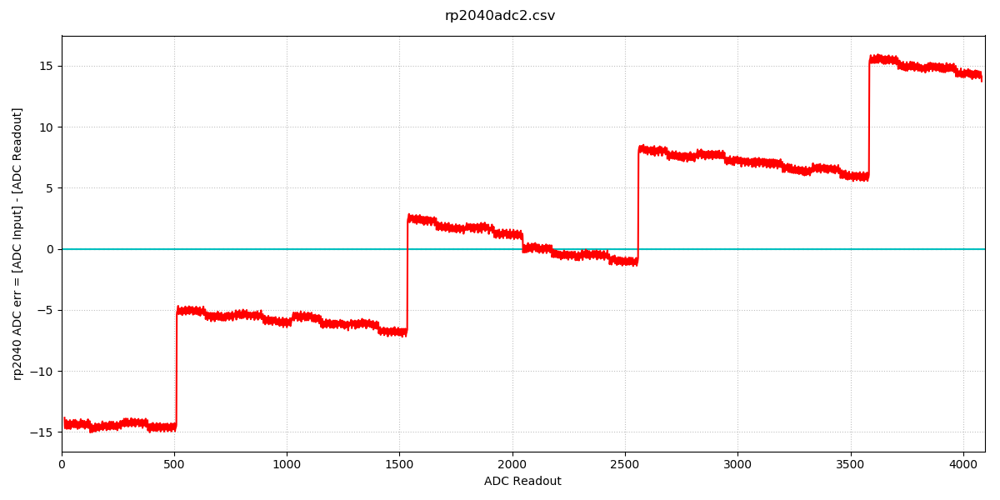
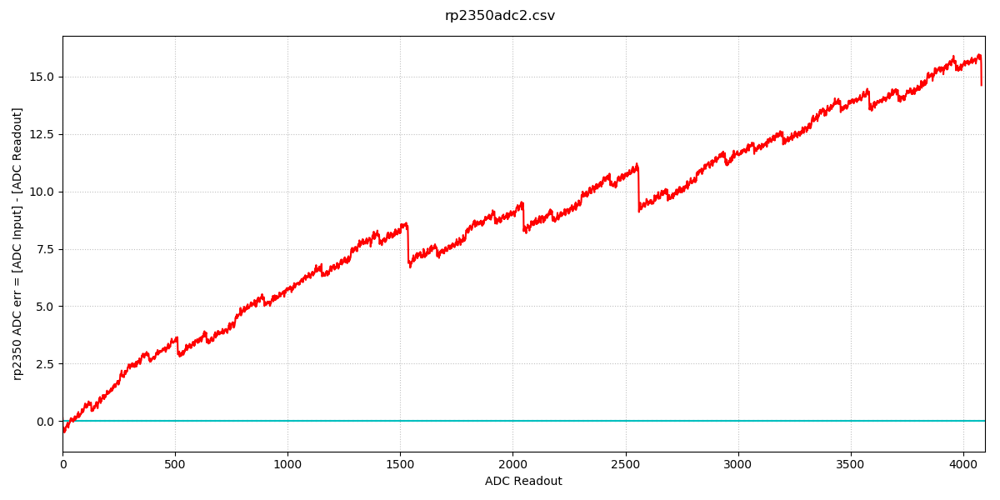
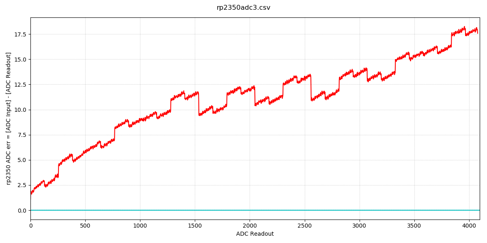
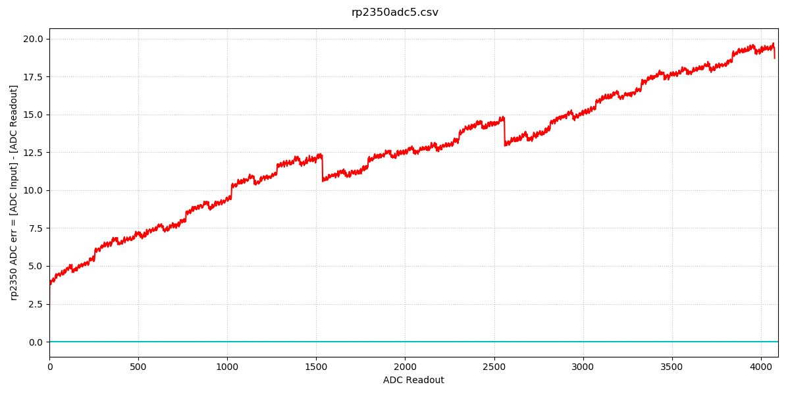
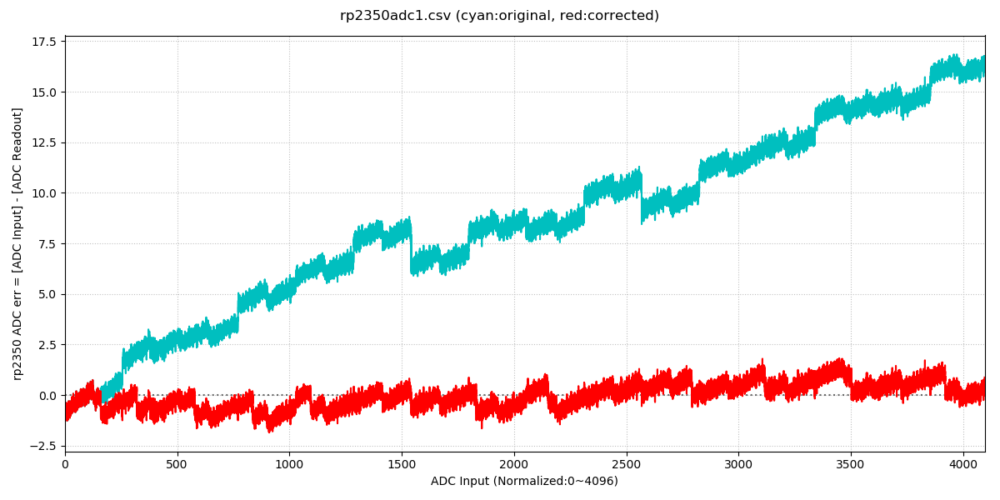
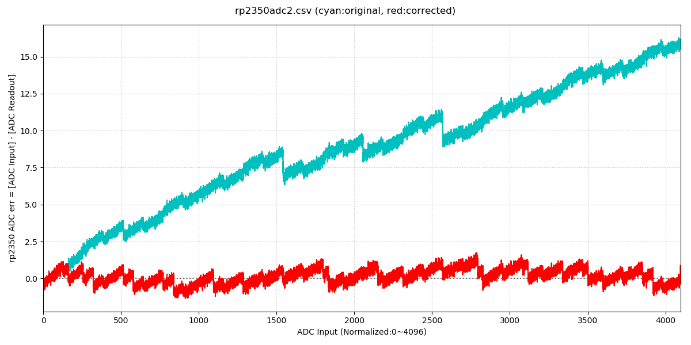
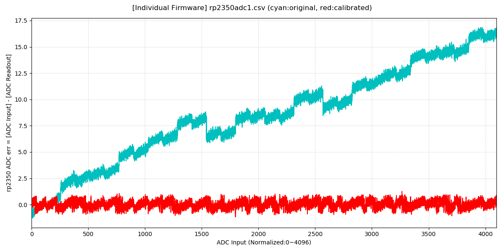
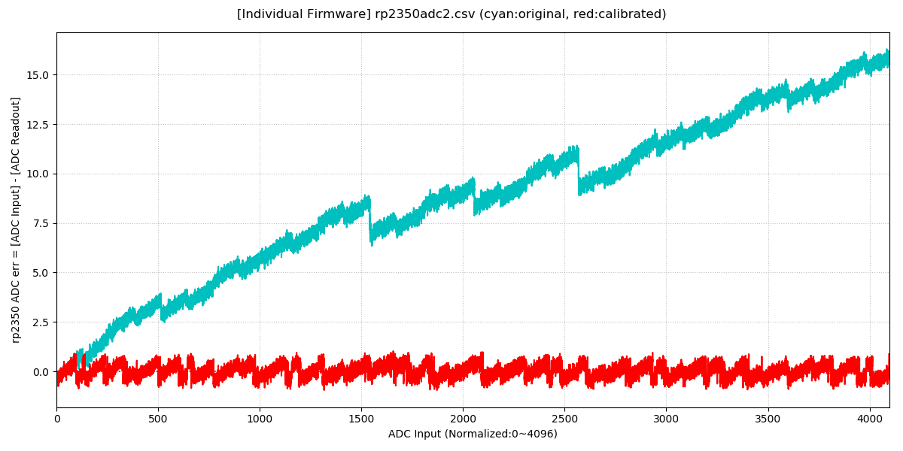
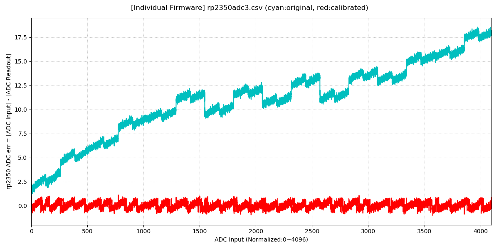
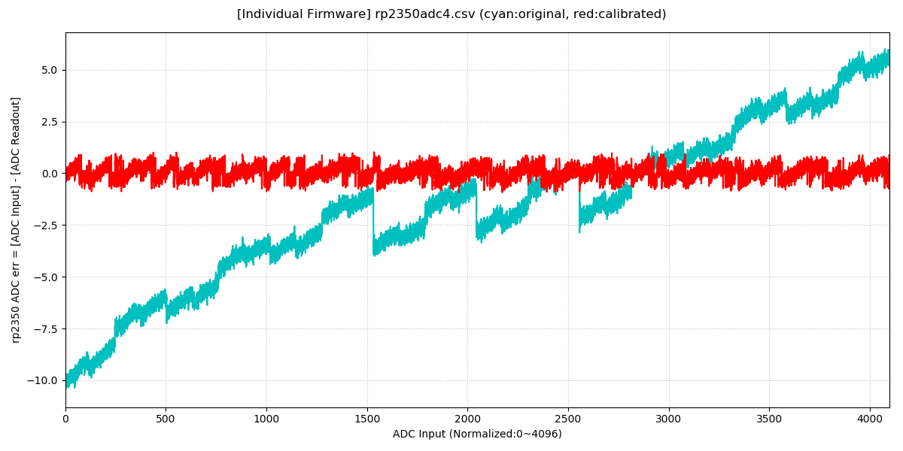

# RP2040/RP2350 A/D non-linearity correction

The purpose of this project is to improve the non-linearity of the ADC in the RP2040 microcontroller, as described by the errata RP2040-E11, using software.  
Furthermore, the project will also cover RP2350.

***Note*** *Lost information cannot be restored. Only improving linearity is possible.*


# RP2040/RP2350 ADC non-linearity
The following graphs show ADC errors on actual Raspberry Pi Pico/Pico W/Pico 2/Pico 2W devices which I possess. (These data are measured by [*measure.py*](./actual_adc_data/measure.py) with [this firmware](./actual_adc_data/picofirmware) and [this circuit](./actual_adc_data/adc_test_board_schematic.pdf). They are in [./actual_adc_data](./actual_adc_data) folder.)

Y-axis is ADC error and X-axis is ADC readout (***not ADC input***).
## RP2040 ADC non-linearity
The raw data are [here](./actual_adc_data/data_rp2040/).  
[](./actual_adc_data/data_rp2040/rp2040adc1.png)
[](./actual_adc_data/data_rp2040/rp2040adc2.png)
[](./actual_adc_data/data_rp2040/rp2040adc3.png)
[](./actual_adc_data/data_rp2040/rp2040adc4.png)
[](./actual_adc_data/data_rp2040/rp2040adc5.png)  
The enormous discontinuities are observed at 512, 1536, 2560 and 3584.

## RP2350 ADC non-linearity
The raw data are [here](./actual_adc_data/data_rp2350/).  
[](./actual_adc_data/data_rp2350/rp2350adc1.png)
[](./actual_adc_data/data_rp2350/rp2350adc2.png)
[](./actual_adc_data/data_rp2350/rp2350adc3.png)
[](./actual_adc_data/data_rp2350/rp2350adc4.png)
[](./actual_adc_data/data_rp2350/rp2350adc5.png)  
RP2350 is improved compared to RP2040, but there's still some non-linearity remaining.


# General-Purpose Correction Code
By averaging the errors of the above five rp2040 devices and five rp2350 devices, I obtained the following code.

## RP2040 GENERAL-PURPOSE CODE
```Python
def rp2040adc_correction(d):
    '''
    rp2040 ADC Correction
      d     : 12 bit ADC readout (0~4095)
      return: corrected ADC value
    '''
    if d >= 4082:
        y = 4095
    elif d >= 4022:
        y = d + 13
    elif d >= 3711:
        y = d + 14
    elif d >= 3584:
        y = d + 15
    elif d == 3583:
        y = 3583 + 10
    elif d >= 3454:
        y = d + 5
    elif d >= 2943:
        y = d + 6
    elif d >= 2560:
        y = d + 7
    elif d == 2559:
        y = 2559 + 2
    elif d >= 2431:
        y = d - 2
    elif d >= 2048:
        y = d - 1
    elif d == 2047:
        y = 2047 + 0
    elif d >= 1664:
        y = d + 1
    elif d >= 1536:
        y = d + 2
    elif d == 1535:
        y = 1535 - 3
    elif d >= 1407:
        y = d - 7
    elif d >= 895:
        y = d - 6
    elif d >= 512:
        y = d - 5
    elif d == 511:
        y = 511 - 10
    elif d >= 16:
        y = d - 15
    else:
        y = 0

    return y
```


## RP2350 GENERAL-PURPOSE CODE
```Python
def rp2350adc_correction(d):
    '''
    rp2350 ADC Correction
      d     : 12 bit ADC readout (0~4095)
      return: corrected ADC value
    '''
    if d >= 4079:
        y = 4095
    elif d >= 4070:
        y = d + 16
    elif d >= 3840:
        y = d + 15
    elif d >= 3632:
        y = d + 14
    elif d >= 3328:
        y = d + 13
    elif d >= 3244:
        y = d + 12
    elif d >= 3200:
        y = d + 11
    elif d >= 3152:
        y = d + 12
    elif d >= 2848:
        y = d + 11
    elif d >= 2784:
        y = d + 10
    elif d >= 2560:
        y = d + 9
    elif d >= 2306:
        y = d + 10
    elif d >= 2144:
        y = d + 9
    elif d >= 2048:
        y = d + 8
    elif d >= 1839:
        y = d + 9
    elif d >= 1776:
        y = d + 8
    elif d >= 1536:
        y = d + 7
    elif d >= 1280:
        y = d + 8
    elif d >= 1092:
        y = d + 7
    elif d >= 864:
        y = d + 6
    elif d >= 768:
        y = d + 5
    elif d >= 593:
        y = d + 4
    elif d >= 335:
        y = d + 3
    elif d >= 255:
        y = d + 2
    elif d >= 160:
        y = d + 1
    else:
        y = d

    return y
```

## Correction result by the general-purpose code
Y-axis is ADC error and X-axis is ADC input (***not ADC readout***).
### RP2040 ADC correction result by the general-purpose code
[](./images/Figure_1.png)
[](./images/Figure_2.png)
[](./images/Figure_3.png)
[](./images/Figure_4.png)
[](./images/Figure_5.png)  
The red line shows the error with correction, and the cyan line shows the error without correction.

### RP2350 ADC correction result by the general-purpose code
[](./images/rp2350_gc1.png)
[](./images/rp2350_gc2.png)
[](./images/rp2350_gc3.png)
[](./images/rp2350_gc4.png)
[](./images/rp2350_gc5.png)  
The red line shows the error with correction, and the cyan line shows the error without correction.


# Best Calibration by Individual Code
If you can use individual code for each device, that means each device has its own customized firmware, you can use the following formula that gives better correction:

`ADC_CORRECTED = ADC_READOUT + rp2040adc_err[ADC_READOUT]`

Where `rp2040adc_err[]` is the array created by [*calc_err.py*](./actual_adc_data/data_rp2040), and has error data for specific device measured by yourself using [*measure.py*](./actual_adc_data). (Each device needs its own `rp2040adc_err[]`.)

**Individual code templates:**  
+ C/C++ template ([template_rp2040adc.h](./template_rp2040adc.h), [template_rp2350adc.h](./template_rp2350adc.h))
+ Python template ([template_rp2040adc.py](./template_rp2040adc.py), [template_rp2350adc.py](./template_rp2350adc.py))

## Calibration result by individual code
Y-axis is ADC error and X-axis is ADC input (***not ADC readout***).
### RP2040 ADC calibration result by individual code
[](./images/Figure_6.png)
[](./images/Figure_7.png)
[](./images/Figure_8.png)
[](./images/Figure_9.png)
[](./images/Figure_a.png)  
The red line shows the error with correction, and the cyan line shows the error without correction.

### RP2350 ADC calibration result by individual code
[](./images/rp2350_ic1.png)
[](./images/rp2350_ic2.png)
[](./images/rp2350_ic3.png)
[](./images/rp2350_ic4.png)
[](./images/rp2350_ic5.png)  
The red line shows the error with correction, and the cyan line shows the error without correction.
